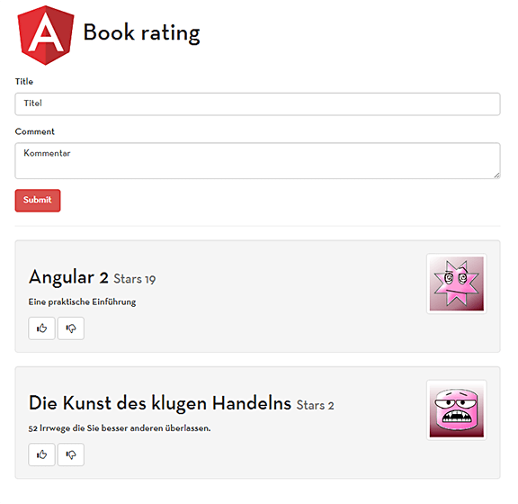

## What?
This is an example Angular 2.0 app that we have shown at our live-coding sessions.
**Angular 2.0.0-rc.4, SystemJS, Bootstrap 3, reflect-metadata... This application is so old that you get a true retro feeling again.**

## Demo
You can see the app in action at:
__[angular-2-book-rating-app](https://angular-2-book-rating-app.angular-buch.com/)__

## Running the app locally
Download or clone the app from Github.
Then run the following commands:

```cmd
cd book-rating
npm install
npm start
```

----

&copy; 2016 - [Johannes Hoppe](http://haushoppe-its.de/), [Danny Koppenhagen](http://d-koppenhagen.de/), [Ferdinand Malcher](http://ferdinand-malcher.de/) & [Gregor Woiwode](http://woiwode.info/)
